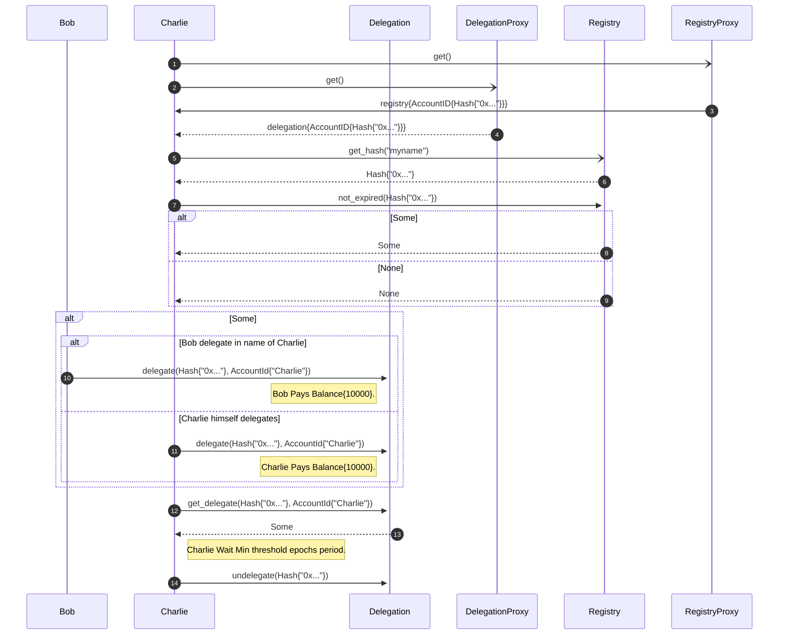

# Delegate Workflow sequence diagram

This chart shows the sequence for delegating to indexer, collecting fees and undelegating

```mermaid
sequenceDiagram
    autonumber
    participant B as Bob
    participant C as Charlie 
    participant D as Delegation
    participant DP as DelegationProxy
    participant R as Registry
    participant RP as RegistryProxy
    C -) RP : get()
    C -) DP : get()
    RP->>C : registry{AccountID{Hash{"0x..."}}}
    DP-->>C : delegation{AccountID{Hash{"0x..."}}}
    C -) R : get_hash("myname")
    R-->>C : Hash{"0x..."}
    C ->>+ R : not_expired(Hash{"0x..."})
    alt Some
        R-->>C : Some
    else None
        R-->>C : None
    end
    alt Some
        alt Bob delegate in name of Charlie
            B ->>+ D : delegate(Hash{"0x..."}, AccountId{"Charlie"})
            note left of D: Bob Pays Balance{10000}.
        else Charlie himself delegates
            C ->>+ D : delegate(Hash{"0x..."}, AccountId{"Charlie"})
            note left of D: Charlie Pays Balance{10000}.            
        end
    end
    C ->>+ D : get_delegate(Hash{"0x..."}, AccountId{"Charlie"})
    D -->>C : Some
    note right of C: Charlie Wait Min threshold epochs period.
    C ->>+ D : undelegate(Hash{"0x..."})
```