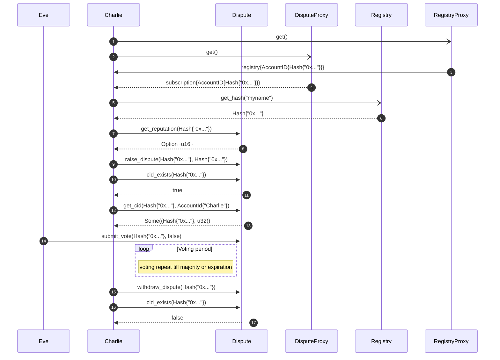

# Dispute Workflow sequence diagram

This chart shows the sequence for subscribing to indexer, collecting fees and unsubscribe

```mermaid
sequenceDiagram
    autonumber
    participant E as Eve
    participant C as Charlie 
    participant D as Dispute
    participant DP as DisputeProxy
    participant R as Registry
    participant RP as RegistryProxy
    C -) RP : get()
    C -) DP : get()
    RP->>C : registry{AccountID{Hash{"0x..."}}}
    DP-->>C : subscription{AccountID{Hash{"0x..."}}}
    C -) R : get_hash("myname")
    R-->>C : Hash{"0x..."}
    C ->>+ D : get_reputation(Hash{"0x..."})
    D -->> C : Option~u16~
    C ->>+ D : raise_dispute(Hash{"0x..."}, Hash{"0x..."})
    C ->>+ D : cid_exists(Hash{"0x..."})
    D -->> C : true
    C ->>+ D : get_cid(Hash{"0x..."}, AccountId{"Charlie"})
    D -->> C : Some((Hash{"0x..."}, u32))
    E ->>+ D : submit_vote(Hash{"0x..."}, false)
    loop Voting period
        note left of D: voting repeat till majority or expiration
    end
    C ->>+ D : withdraw_dispute(Hash{"0x..."})
    C ->>+ D : cid_exists(Hash{"0x..."})
    D -->> C : false    
    
```