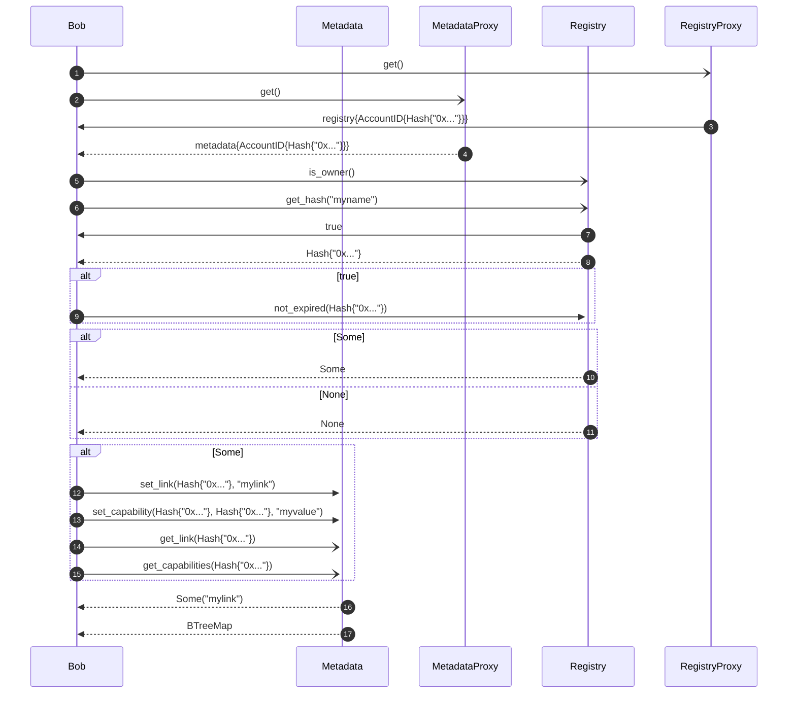

# Register metadata Workflow sequence diagram

This chart shows the sequence for setting metadata link and capabilities

```mermaid
sequenceDiagram
    autonumber
    participant B as Bob    
    participant M as Metadata
    participant MP as MetadataProxy
    participant R as Registry
    participant RP as RegistryProxy
    B -) RP : get()
    B -) MP : get()
    RP->>B : registry{AccountID{Hash{"0x..."}}}
    MP-->>B : metadata{AccountID{Hash{"0x..."}}}
    B -) R : is_owner()
    B -) R : get_hash("myname")
    R->>B : true
    R-->>B : Hash{"0x..."}
    alt true
        B ->>+ R : not_expired(Hash{"0x..."})
    end
    alt Some
        R-->>B : Some
    else None
        R-->>B : None
    end
    alt Some
        B ->>+ M : set_link(Hash{"0x..."}, "mylink")
        B ->>+ M : set_capability(Hash{"0x..."}, Hash{"0x..."}, "myvalue")
        B -) M : get_link(Hash{"0x..."})
        B -) M : get_capabilities(Hash{"0x..."})        
    end
    M-->>B : Some("mylink")
    M-->>B : BTreeMap

```
