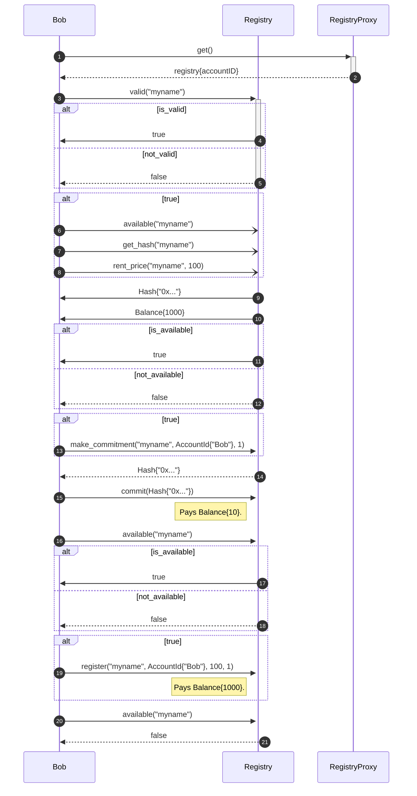

# Register name Workflow sequence diagram

```mermaid
sequenceDiagram
    autonumber
    participant B as Bob    
    participant R as Registry
    participant RP as RegistryProxy
    B ->>+ RP : get()
    RP -->>- B : registry{accountID}
    B ->>+ R : valid("myname")
    alt is_valid
        R->>B : true
    else not_valid
        R-->>-B : false
    end
    alt true
        B -) R : available("myname")
        B -) R : get_hash("myname")
        B -) R : rent_price("myname", 100)
    end
    R->>B : Hash{"0x..."}
    R->>B : Balance{1000}
    alt is_available
        R->>B : true
    else not_available
        R-->>B : false        
    end
    alt true
        B ->>+ R : make_commitment("myname", AccountId{"Bob"}, 1);
    end
    R-->>B : Hash{"0x..."}
    B ->>+ R : commit(Hash{"0x..."})
    note left of R: Pays Balance{10}.
    B ->> R : available("myname")
    alt is_available
        R->>B : true
    else not_available
        R-->>B : false        
    end
    alt true
        B ->>+ R : register("myname", AccountId{"Bob"}, 100, 1);
        note left of R: Pays Balance{1000}.
    end
    B ->> R : available("myname")
    R-->>B : false

```